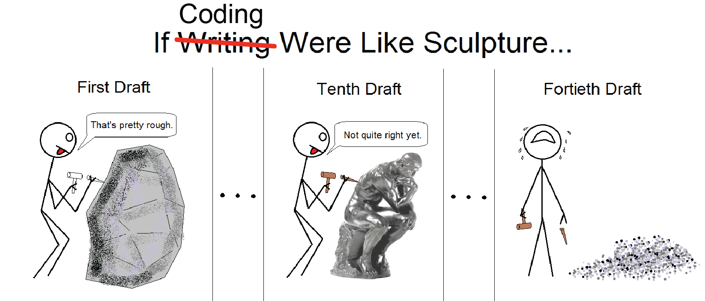
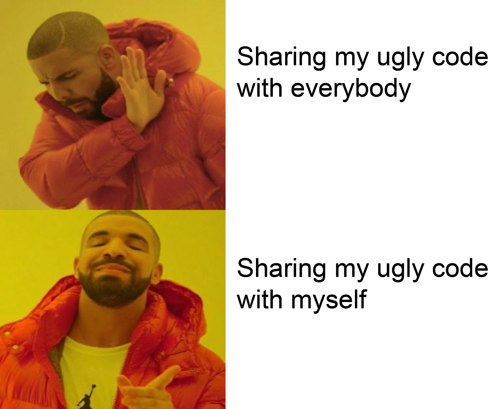

# GitHub Tutorial

### Version control:
<p align="center">
 
</p>

Just as experiments are logged in laboratory notebooks, it is important to document the code you use for analysis. However, there are key problems that can arise during code development that make it difficult to document and track which code version was used to create each result. 

<p align="center">
 
</p>

**Code can continuously evolve and sometimes as you are making it better you can also risk breaking it.**
1. Experiment with new ideas such as adding new features to a script, but we don't want to risk breaking currently working code.

**You will likely share your code with others**

2. Shared code can be improved upon by collaborators or others in the community, but we don't want to have multiple people emailing you code improvements or else you will lose track and will have to manually incorporate the changes.
 
It would be nice to have some sort of version control system that allows you to play with your code, while still having the ***old*** working code intact and running. Or a place to recieve code suggestions and check it before incorporating it.

**GitHub is a popular platform that allows for version control and collaboration:**
<p align="center">
 
</p>

### What is GitHub?:
GitHub is primarily a web platform, which hosts code repositories along with distributed version control. Today, almost every developer working on a group project or individually uses GitHub as an important tool due to its capability of making version control easier. It provides access control and several collaboration features such as bug tracking, feature requests, task management for every project. It's a great place where you can store and/or share your code, manage projects and publish code. 

**GitHub essentials are:**
1. Repositories
    - Used to organize a single project. Contains folders, files, images ect. ***Always include a README, or a file with information about your project.*** 
2.  Branching
    - This is the way you work on different versions of a repository at one time. Branches are used to experiment and make edits before committing  to the main or ```master``` branch. 
3.  Commits
    - Saved changes or checkpoints are called commits. Always include a message with your commit (more on that later), which is a description explaining why a particular change was made. This is important because these messages will capture a history of your changes and you will be able to understand what you did and why.
4.  Pull request
    - After you have made changes in a branch off of the ```master``` branch, you can open a pull request. This is where you propose changes and request your code be reviewed, discussed and merged into whatever branch you pulled from.
4.  Merge Pull request
    - Final step, time to bring  your changes together.
   
**The three main features to the basic GitHub flow that make GitHub so widely used and powerful – branching, pull request and merge.** 
<p align="center">
 
</p>

### GitHub users now get unlimited private repositories with up to three collaborators.


**Create a username and password that is easy for you to type. For the rest of this exercise, you will need to be logged into GitHub.
GitHub.com uses its own version of the Markdown syntax.**

-Here is a great tutorial/cheat sheet on the markdown syntax by [@thanpolas](https://github.com/thanpolas/Practice/blob/master/Markdown-Cheatsheet.md)

-Extra [tutorial](https://guides.github.com/activities/hello-world/)

-Simple break down of how to use [GitHub](https://guides.github.com/introduction/flow/)

### Pedro J. Torres
