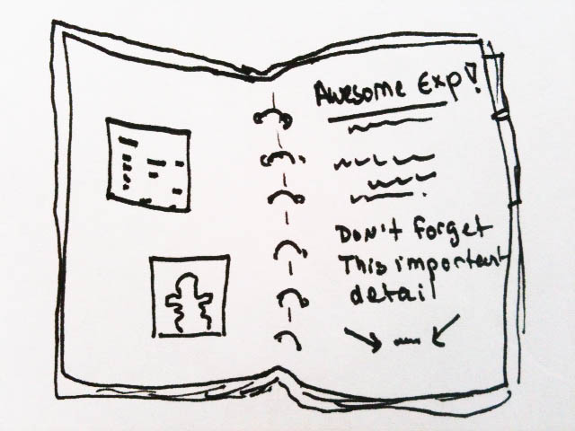

# GitHub Tutorial <align="right" img src="https://github.com/favicon.ico" width="48">

### Version control:

 

Just as experiments are logged in laboratory notebooks, it is important to document the code you use for analysis. However, there are key problems that can arise during code development that make it difficult to document and track which code version was used 
 
### GitHub is primarily a web platform, which hosts code repositories along with distributed version control. Today, almost every developer working on a group project or individually uses GitHub as an important tool due to its capability of making version control easier. It provides access control and several collaboration features such as bug tracking, feature requests, task management for every project. It's a great place where you can store and share your code, manage projects and publish code. 
### There are three main features to the basic GitHub flow that make GitHub so widely used and powerful – branching, pull request and merge. 

1) Branching allows you to create a new environment to test ideas and make changes.
2) Pull request allows you tell the other person about your changes and tell them. They can then review the changes, discuss it.
3) These changes can then be merged into the original repository.

### Create a username and password that is easy for you to type. For the rest of this exercise, you will need to be logged into GitHub.
### GitHub.com uses its own version of the Markdown syntax. Here is a great tutorial/cheat sheet on the markdown syntax by [@thanpolas](https://github.com/thanpolas/Practice/blob/master/Markdown-Cheatsheet.md)
### Let's follow this [tutorial](https://guides.github.com/activities/hello-world/)
### Simple break down of how to use [GitHub](https://guides.github.com/introduction/flow/)

### Pedro J. Torres
